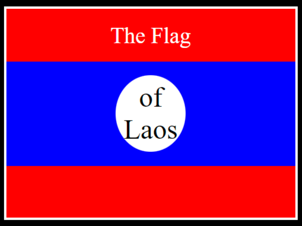

# CSS Flag

## Frontend Challenge

## Description

This was a coding challenge presented by [Dr. Angela Yu](https://www.udemy.com/user/4b4368a3-b5c8-4529-aa65-2056ec31f37e/) within her [Udemy Course](https://www.udemy.com/course/the-complete-web-development-bootcamp/).

## Challenge Instructions

IMPORTANT! Do not change any HTML
Don't add any classes/ids/elements
Use what you know about combining selectors
and CSS specificity instead.
Hint 1: The flag is 900px by 600px and the circle is 200px by 200px.
Hint 2: You can use CSS inspection to get the colors from
https://appbrewery.github.io/flag-of-laos/

## About

Hello, my name is David  
You can email me at [dwhipp88@gmail.com](mailto:dwhipp88@gmail.com)  
You can view my [github](https://github.com/D-Whipp).  
Check out my [portfolio](https://splendid-ganache-f82581.netlify.app/).  
Let's make a connection! [LinkedIn](https://www.linkedin.com/in/david-w-079841213/)
